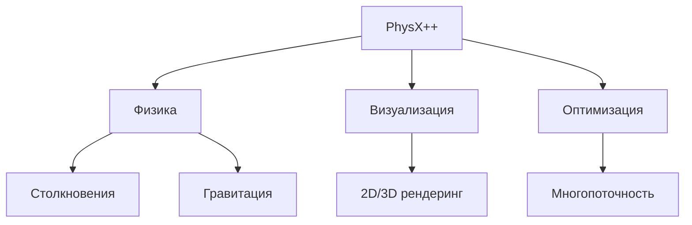
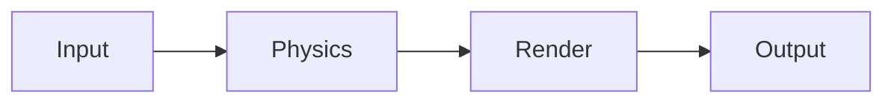
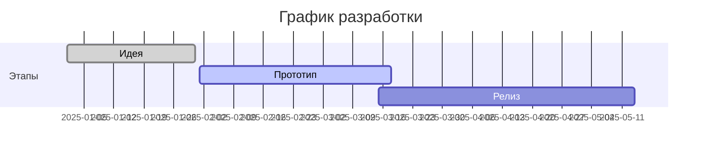

Вот преобразованный Markdown-документ, объединяющий все страницы вашего проекта PhysX++ в единую структуру с сохранением стиля и функциональности:

```markdown
# PhysX++ - Физический движок на C++

## Навигация
- [Главная](#главная)
- [О проекте](#о-проекте)
- [Участники](#участники)
- [Журнал разработки](#журнал-разработки)
- [Ресурсы](#ресурсы)

---

## Главная

**PhysX++** - современный физический движок для моделирования и визуализации физических процессов.



**Основные возможности:**
- Реалистичное моделирование физических процессов
- Высокопроизводительные вычисления
- Интуитивная визуализация
- Кроссплатформенная поддержка

[Подробнее о проекте →](#о-проекте)

---

## О проекте

### Описание
Проект представляет собой разработку физического движка на C++ для:
- Образовательных целей
- Игровых движков
- Научных симуляций

### Технологический стек
| Компонент       | Назначение               |
|----------------|--------------------------|
| C++17          | Основной язык            |
| SFML           | Графика и ввод           |

### Архитектура


---

## Участники

### Команда разработки

#### Грачев Павел
- **Роль**: Разработчик интерфейса
- **Задачи**:
  - Создание пользовательского интерфейса
  - Адаптивная верстка
  - Интеграция компонентов

#### Рябов Михаил
- **Роль**: Физический программист
- **Задачи**:
  - Реализация физических алгоритмов
  - Оптимизация производительности
  - Тестирование столкновений

#### Ткачев Дмитрий
- **Роль**: Архитектор проекта
- **Задачи**:
  - Проектирование системы
  - Координация команды
  - Контроль качества

---

## Журнал разработки

### Хронология работ

1. **Идея проекта** (Январь 2025)
   - Определение требований
   - Анализ конкурентов
   - Формирование команды

2. **Прототип** (Февраль 2025)
   - Базовые физические расчеты
   - Простая визуализация
   - Тестирование производительности

3. **Финальная версия** (Март 2025)
   - Оптимизация кода
   - Полная документация
   - Демонстрационные сцены



---

## Ресурсы

### Полезные материалы
- [Документация SFML](https://www.sfml-dev.org/)
- [Руководство по Box2D](https://box2d.org/)
- [Примеры кода на GitHub](https://github.com/physx-plus-plus)

### Контакты
✉️ Email: contact@physxpp.dev  
💬 Telegram: @physxpp_support

---

© 2025 PhysX++ Team | [Политика конфиденциальности](#) | [Условия использования](#)
```
